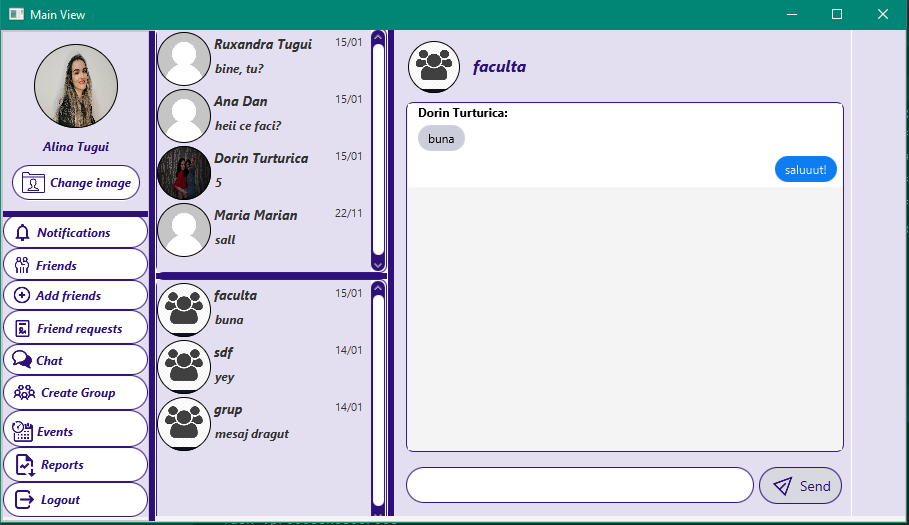

# MeetAppSocialNetworkGUI
MeepApp - University project in collaboration with @Dorin Turturica 
General Info 
1. The application allows the user to create an account, to log in and the main features are: 
  - friendship management - send, receive friend requests
  - event management - create an event
  - event subscription - receive notifications about events that you have subscribed to
  - chat - private/group chats with your friends
  - statistics - pie charts, pdf report format.
  
2. Used Technologies
  - JavaFX
  - PostgreSQL
  - SceneBuilder
  - Gradle
    
 3. Presentation
  
  
  
  
  
  
  
  
  
  
  
  
  
  

 4. Future Development
  - Dark Theme
  - NewsFeed
  - Multithreading for Notifications.
  
